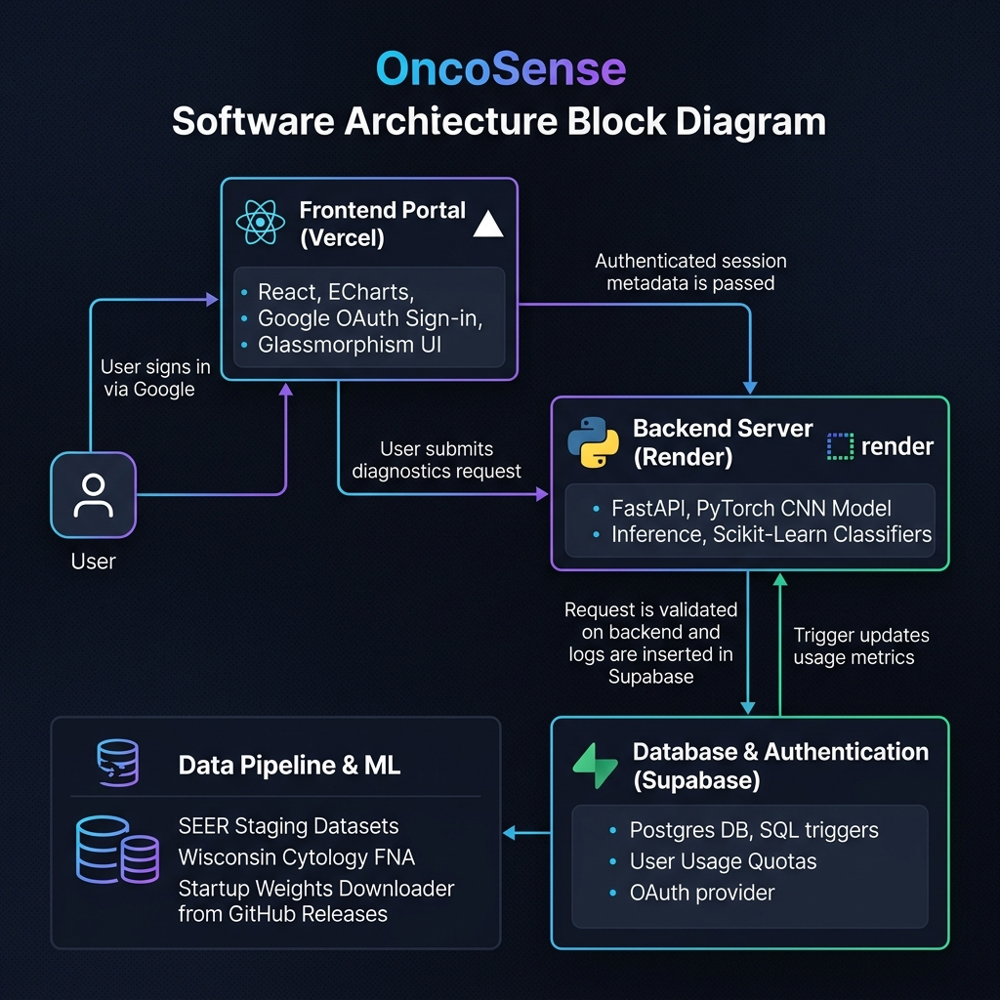

# OncoSense — Unified Breast Cancer Diagnosis & Prognosis Portal

OncoSense is a production-grade, multi-modal clinical intelligence application for breast cancer assessment. It integrates three separate diagnostic pipelines into a unified web application:
1.  **Wisconsin FNA Cytology (Diagnosis)**: Classical ML models identifying benign vs. malignant tumor cells from nuclear biopsy measurements.
2.  **SEER Staging Cohort (Prognosis)**: Clinical models predicting patient mortality risk based on age, staging, size, and hormone receptor statuses.
3.  **Histopathology Image Classifier (Deep Learning)**: A PyTorch CNN classifying raw tissue biopsy slide images dynamically.

---

## 🏗️ System Architecture

The following block diagram outlines the decoupled full-stack architecture of OncoSense, detailing the user authentication, diagnostic pipeline, and usage telemetry tracing flows:



---

## 📊 Model Performance Matrix

### 1. Wisconsin FNA Cytology (Diagnosis Tab)
*Wisconsin Diagnostic Dataset: 569 samples, 30 cytological features.*

| Model | Accuracy | Precision | Recall | F1-Score | ROC-AUC |
|:---|:---:|:---:|:---:|:---:|:---:|
| **K-Nearest Neighbors (KNN)** | **96.49%** | 95.95% | 98.61% | 97.26% | 97.14% |
| **Multi-Layer Perceptron (MLP)** | 95.61% | 95.89% | 97.22% | 96.55% | 99.21% |
| **Logistic Regression** | 95.61% | 98.55% | 94.44% | 96.45% | 99.54% |
| **Support Vector Machine (SVM)** | 95.61% | 98.55% | 94.44% | 96.45% | 99.54% |
| **Random Forest** | 93.86% | 95.77% | 94.44% | 95.10% | 99.34% |

### 2. SEER Patient Cohort (Prognosis Tab)
*SEER Breast Cancer dataset: 4,024 patient staging profiles.*

| Model | Accuracy | Precision | Recall | F1-Score | ROC-AUC | Optimal Hyperparameters |
|:---|:---:|:---:|:---:|:---:|:---:|:---|
| **Random Forest** | **89.94%** | 91.91% | 96.63% | 77.91% | 85.18% | `n_estimators: 100`, `max_depth: 10` |
| **Multi-Layer Perceptron (MLP)** | 88.82% | 89.89% | 97.80% | 72.65% | 86.37% | `alpha: 0.001`, `hidden_layer_sizes: [64, 32]` |
| **K-Nearest Neighbors (KNN)** | 87.33% | 88.67% | **97.51%** | 67.79% | 75.73% | `n_neighbors: 5`, `weights: "distance"` |
| **Support Vector Machine (SVM)** | 82.36% | 93.13% | 85.48% | 71.06% | 84.44% | `C: 1`, `kernel: "rbf"` |
| **Logistic Regression** | 81.37% | **95.24%** | 82.11% | 72.04% | 87.83% | `C: 0.1`, `penalty: "l2"`, `solver: "lbfgs"` |

### 3. Deep Learning histopathology (Image Classifier Tab)
*BreaKHis 400X Image Dataset: 1,693 biopsy slides.*

*   **Architecture**: EfficientNet-B0 (Transfer Learning) + Custom Classification Head.
*   **Hyperparameters**: learning_rate = `0.0003`, batch_size = `32`, patience = `6`.
*   **Split Ratio**: Exact 70/15/15 split (Train = 1,187 | Val = 253 | Test = 253).
*   **Early Stopping**: Triggered after **22 epochs** (Best validation checkpoint loss: **0.0889**).
*   **Test Set Accuracy**: **97.23%** (F1-score: **0.9790**).

---

## 🚀 Running OncoSense Locally

### 1. Setup & Dependencies
```bash
# Create and activate environment
python3 -m venv venv
source venv/bin/activate

# Install pipeline and API packages
pip install -r requirements.txt
```

### 2. Orchestrated Pipeline Execution
Launch classical ML training or deep learning training via the unified CLI orchestrator:
*   **Run Classical/Clinical Pipelines (Wisconsin & SEER)**:
    ```bash
    python src/pipeline.py
    ```
*   **Run Deep Learning CNN Pipeline**:
    ```bash
    python src/pipeline.py --cnn
    ```

### 3. Run Web Application Services
**A. Start FastAPI Backend:**
```bash
source venv/bin/activate
python src/api.py
```
*API runs at `http://localhost:8000`.*

**B. Start Vite React Frontend:**
```bash
cd frontend
npm install
npm run dev
```
*Dashboard portal runs at `http://localhost:5173`.*

---

## ☁️ Deployment Environment Settings

### Frontend (Vercel)
Add the environment variable:
*   `VITE_API_BASE_URL`: *[URL of your hosted Render API]*

### Backend (Render)
Pre-trained model binary weights (`best_model.pth`) are ignored in Git to avoid repository bloat. To enable live histopathology image classification on the cloud:
1.  Upload your `best_model.pth` to a public storage folder (e.g., GitHub Releases).
2.  Add the environment variable on Render:
    *   `DL_MODEL_WEIGHTS_URL`: *[Direct download link to your best_model.pth]*
    
*The backend automatically fetches and caches these weights on startup, enabling real-time image analysis.*


