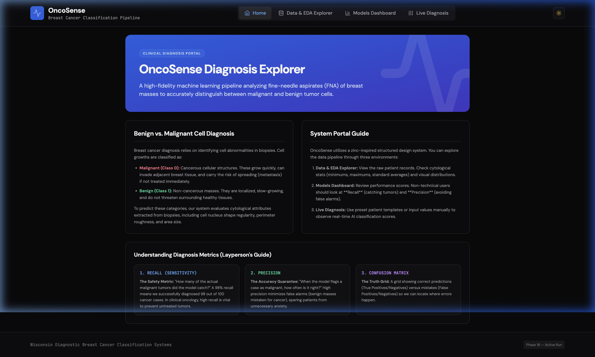
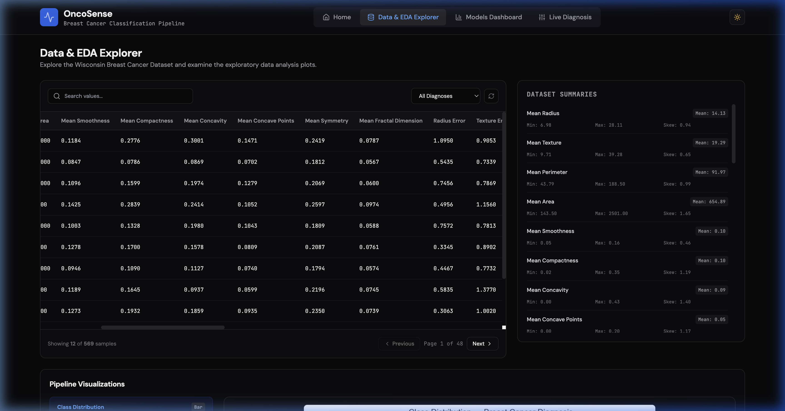
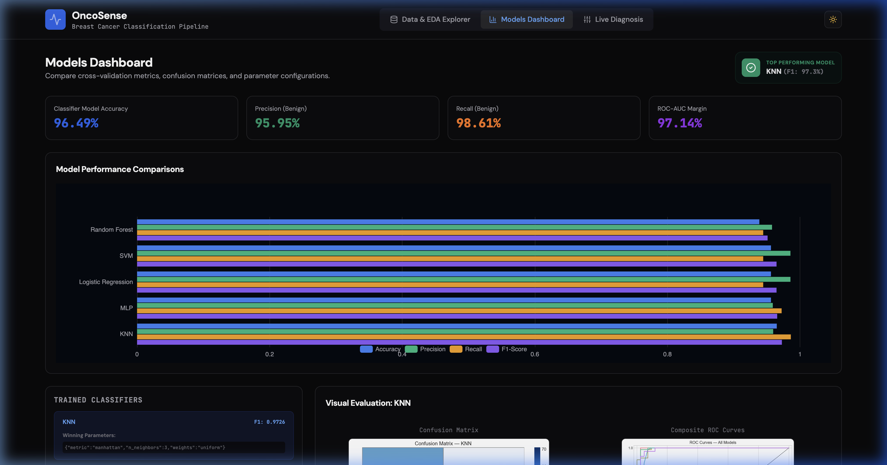
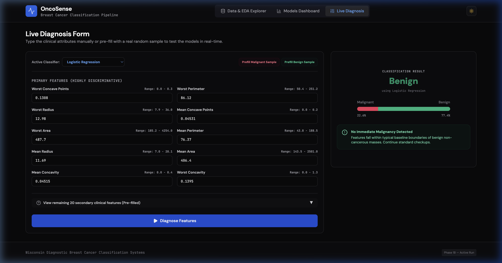

# OncoSense — Breast Cancer Diagnosis

A production-grade breast cancer classification system using the Wisconsin Diagnostic dataset, complete with a self-documenting machine learning pipeline and a dual-service React + FastAPI web application.

## 🖥️ Portal Interface Screenshots

### 1. Default Portal Home View
Detailed layperson guides to classification concepts (Benign vs Malignant) and mathematical metrics.


### 2. Scrollable Data Table Explorer
A spreadsheet view displaying all 30 cytological features with a horizontal scrollbar.


### 3. Models Comparison Dashboard
ECharts visualizations of accuracy, precision, recall, and F1 across five classical ML models, with individual confusion matrix selectors.


### 4. Interactive Live Diagnosis Form
Test classification predictions in real-time using patient records or customized input values.


---

## 🎯 Project Goal
Build a self-documenting, error-tracking ML pipeline for breast cancer diagnosis (benign vs malignant) using classical ML models.

## 📊 Dataset
- **Name**: Wisconsin Breast Cancer Diagnostic
- **Samples**: 569 (357 benign, 212 malignant)
- **Features**: 30 numeric features (radius, texture, perimeter, area, smoothness, etc.)
- **Source**: Built-in `sklearn.datasets`

---

## 🚀 Quick Start

### 1. Setup & Installation
```bash
# Create virtual environment
python3 -m venv venv
source venv/bin/activate

# Install pipeline and backend dependencies
pip install -r requirements.txt
```

### 2. Run Data & Training Pipeline
Runs the end-to-end ML training pipeline, logs step-by-step statuses, and saves metrics/models.
```bash
python src/pipeline.py
```

### 3. Run Web Application Services

**A. Start FastAPI Backend:**
```bash
# From project root
source venv/bin/activate
python src/api.py
```
*API runs at `http://localhost:8000` (docs available at `/docs`).*

**B. Start Vite React Frontend:**
```bash
# From project root
cd frontend
npm install
npm run dev
```
*Dashboard portal runs at `http://localhost:5173`.*

### 4. Run Test Suite
```bash
# Run core pipeline + API endpoint integration tests
python -m pytest tests/ -v
```

---

## 📁 Project Structure
```
breast-cancer-diagnosis/
├── README.md               # This file
├── PLAN.md                 # Living project plan
├── TRACKER.md              # Issue tracker (error memory)
├── CHANGELOG.md            # Version history
├── requirements.txt        # Backend dependencies
├── config/config.py        # Centralized configuration
├── docs/images/            # Application interface screenshots
├── data/                   # Raw + processed data
├── frontend/               # Vite + React + Tailwind CSS client portal
├── src/                    # Source code
│   ├── api.py              # FastAPI backend server
│   ├── data_loader.py      # Data loading & validation
│   ├── eda.py              # Exploratory Data Analysis
│   ├── feature_engineering.py  # Feature processing & scaler export
│   ├── model_training.py   # Model training (5 models)
│   ├── evaluation.py       # Metrics & visualization
│   ├── pipeline.py         # End-to-end orchestrator
│   └── utils.py            # Logging & helpers
├── models/                 # Saved model and scaler artifacts
├── reports/                # Plots & result CSVs
└── tests/                  # Automated test suite (including test_api.py)
```

## 🔄 Phases
| Phase | Description | Status |
|-------|-------------|--------|
| 1A | Wisconsin dataset + Classical ML | ✅ Completed |
| 1B | React + FastAPI Interactive Web App | ✅ Completed |
| 1C | SEER dataset (~4M records) | ⬜ Planned |
| 2  | Image-based DL (BreakHis/CBIS-DDSM) | ⬜ Planned |

